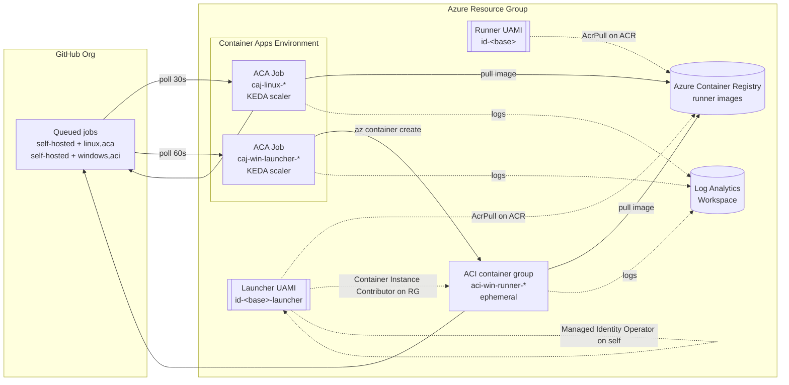
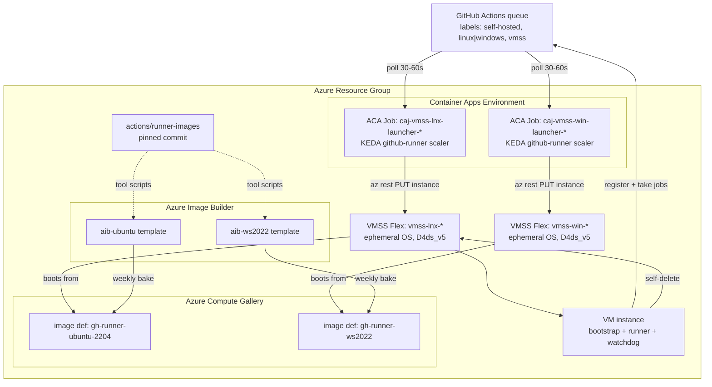

# Architecture

Event-driven, ephemeral [GitHub Actions self-hosted runners](https://docs.github.com/en/actions/hosting-your-own-runners/managing-self-hosted-runners/about-self-hosted-runners) on [Azure Container Apps Jobs](https://learn.microsoft.com/en-us/azure/container-apps/jobs) (Linux), [Azure Container Instances](https://learn.microsoft.com/en-us/azure/container-instances/container-instances-overview) (Windows), and optional [Azure VM Scale Sets](https://learn.microsoft.com/en-us/azure/virtual-machine-scale-sets/overview) (full Docker / WSL2 / Hyper-V parity), all scaled by the [KEDA `github-runner` scaler](https://keda.sh/docs/latest/scalers/github-runner/).

## Tiers at a glance

Four runner tiers are available; the two VMSS tiers are **opt-in** (see [VMSS Tiers (opt-in)](#vmss-tiers-opt-in)) and default to disabled.

| Tier | Host | OS | Docker | WSL2 / Hyper-V | KEDA labels | Cold start | Warm retention | Notes |
|---|---|---|---|---|---|---|---|---|
| `aca-linux` | ACA Job | Ubuntu 22.04 (container) | ❌ | ❌ | `self-hosted,linux,aca` | ~20s | n/a (1:1 ephemeral) | Lowest cost, scale-to-zero |
| `aci-windows` | ACI via Linux launcher | Windows Server Core 2022 (container) | ❌ | ❌ | `self-hosted,windows,aci` | ~60s | n/a (1:1 ephemeral) | Scale-to-zero; no nested virt |
| `vmss-linux` *(opt-in)* | VMSS Flex + AIB Ubuntu 22.04 VHD | Ubuntu 22.04 (full VM) | ✅ Moby + buildx + compose | ❌ (Linux VM) | `self-hosted,linux,vmss` | ~2-3 min cold / instant warm | Sliding idle window (default 60 min) + hard cap (default 12 h) | Runner-images tool parity |
| `vmss-windows` *(opt-in)* | VMSS Flex + AIB WS2022 VHD | Windows Server 2022 (full VM) | ✅ Moby / Docker CE | ✅ WSL2 + Hyper-V (nested virt) | `self-hosted,windows,vmss` | ~3-5 min cold / instant warm | Sliding idle window (default 60 min) + hard cap (default 12 h) | Runner-images tool parity |

## Overview



## Components

### Linux runner (direct)

A KEDA-triggered [ACA Job](https://learn.microsoft.com/en-us/azure/container-apps/jobs) scales from 0 to N. Each execution pulls `github-runner-linux:stable` from ACR, generates a GitHub App JWT, exchanges it for a registration token, and runs one ephemeral job.

- Base image: [`ghcr.io/actions/actions-runner`](https://github.com/actions/runner/pkgs/container/actions-runner)
- Registration: `--ephemeral --disableupdate`
- KEDA poll interval: 30s
- Scale target: queued jobs with labels `self-hosted,linux,aca`

### Windows runner (launcher + ACI)

ACA [does not support Windows containers](https://learn.microsoft.com/en-us/azure/container-apps/containers#limitations), so Windows uses a two-stage pattern:

1. A lightweight Linux ACA Job (`caj-win-launcher-*`) is KEDA-triggered.
2. It authenticates to Azure via its own launcher managed identity (`id-<base>-launcher`) and creates a full Windows [ACI container group](https://learn.microsoft.com/en-us/azure/container-instances/container-instances-container-groups) named `aci-win-runner-<last-10-alnum-of-hostname>-<6-hex-random>` (the random suffix avoids collisions when ACA replicas share a hostname prefix).
3. It polls the group until the Windows runner finishes, then deletes the ACI group.

- Launcher `replicaTimeout`: 4h (covers long-running Windows jobs)
- KEDA poll interval: 60s (avoids double-scaling while ACI registers)
- Scale target: queued jobs with labels `self-hosted,windows,aci`

### KEDA scaler

Both ACA jobs use the [`github-runner` KEDA scaler](https://keda.sh/docs/latest/scalers/github-runner/) with auth via a [GitHub App JWT](https://docs.github.com/en/apps/creating-github-apps/authenticating-with-a-github-app). The `appKey` trigger parameter references the ACA secret `github-app-pem`, which is itself a Key Vault-backed reference (see [Secret storage](#secret-storage-key-vault)) -- no PATs involved.

### Identity and auth

| Direction | Method |
|---|---|
| Runner -> GitHub | [GitHub App JWT](https://docs.github.com/en/apps/creating-github-apps/authenticating-with-a-github-app) -> installation access token -> registration token |
| GitHub Actions -> Azure | [OIDC workload identity federation](https://learn.microsoft.com/en-us/entra/workload-id/workload-identity-federation), no secrets |
| Runner -> Azure | [User-assigned managed identity](https://learn.microsoft.com/en-us/azure/active-directory/managed-identities-azure-resources/overview) — runner identity: `AcrPull` on the ACR only. Windows launcher identity (separate UAMI): `AcrPull` on the ACR + `Container Instance Contributor` on the RG + `Managed Identity Operator` on itself (issue #14) |

### Auth flow (both OS types)

1. Container reads `GITHUB_APP_PEM_B64` (base64-encoded PEM stored in Azure Key Vault; the ACA Job resolves it at replica start via a [Key Vault-backed secret reference](https://learn.microsoft.com/en-us/azure/container-apps/manage-secrets?tabs=azure-cli#reference-secret-from-key-vault) using the job's managed identity -- see [Secret storage](#secret-storage-key-vault)).
2. Generates a short-lived RS256 JWT (`iat - 60s`, `exp + 10m`) signed with the PEM.
3. `POST` to installation access token URL -> short-lived access token.
4. `POST` to org runner registration token URL -> ephemeral registration token.
5. Registers with `--ephemeral --disableupdate`, runs one job, exits.

### Secret storage (Key Vault)

The base64-encoded GitHub App PEM is stored as a secret (`gh-app-pem-b64`) in an Azure Key Vault provisioned by `modules/keyvault.bicep`:

- **RBAC-only authorization** -- legacy vault access policies are disabled.
- **Soft-delete (90 days) + purge protection** -- required for production-grade secret storage; purge protection is permanent once enabled.
- The deployment SP writes the secret at deploy time (it already has `Owner` on the RG -- no extra role needed for secret writes during template expansion because the secret is created as a child `Microsoft.KeyVault/vaults/secrets` resource via the RBAC model).
- The two runner UAMIs (`id-${baseName}` and `id-${baseName}-launcher`) are granted `Key Vault Secrets User` scoped to the vault only.

The ACA Jobs declare the secret using the [Key Vault-backed reference pattern](https://learn.microsoft.com/en-us/azure/container-apps/manage-secrets?tabs=azure-cli#reference-secret-from-key-vault):

```bicep
secrets: [
  {
    name: 'github-app-pem'
    keyVaultUrl: keyVaultSecretUri   // versionless URI
    identity: managedIdentityId      // UAMI resource ID
  }
]
```

Consequences:

- The decoded PEM never appears in the compiled ARM template or in the ACA Job's inline secrets blob -- resolves [issue #48](https://github.com/your-org-or-user/actions-runners-az-container-apps/issues/48).
- Rotation is a single `az keyvault secret set` -- ACA resolves the versionless URI at each replica start, so no redeploy is required. See `docs/runbooks/` for the rotation procedure.
- The KEDA `github-runner` scaler's `appKey` trigger parameter references the same ACA secret name (`github-app-pem`); it receives the same KV-resolved base64 PEM as the entrypoint.

## Bicep layout

```
infra/
  main.bicep              entrypoint; wires modules, composes outputs
  main.bicepparam         per-environment parameter file
  modules/
    law.bicep             Log Analytics workspace
    acr.bicep             Azure Container Registry
    identity.bicep        user-assigned managed identity + role assignments
    keyvault.bicep        Key Vault + GitHub App PEM secret + Secrets User role assignments
    cae.bicep             Container Apps Environment
    linux-runner.bicep    Linux runner ACA Job (KEDA-triggered)
    windows-launcher.bicep Windows launcher ACA Job (KEDA-triggered)
```

Legacy role cleanup (pre-#14) runs as a step in `.github/workflows/deploy.yml` using the OIDC-authenticated SP, rather than as a Bicep `deploymentScripts` module — tenant policy blocks the key-based storage auth that deployment scripts require.

### Conventions

- Every module accepts `location`, `name`, and `tags`.
- The LAW shared key is retrieved via `listKeys()` on an `existing` resource in `main.bicep` -- it is never surfaced as a module output.
- Module deployments use explicit `name:` (ARM deployment names, distinct from resource names).
- `@secure()` parameters: `githubAppPemB64`, `logAnalyticsSharedKey`. Never returned through non-secure outputs.
- API versions are intentionally latest (sometimes preview). [BCP081 warnings](https://github.com/Azure/bicep/blob/main/docs/linter-rules/bcp081.md) for unrecognised types are expected and do not block deployment.
- `namingPrefix` and `githubOwner` (previously `githubOrg`) have **no defaults** -- they must be supplied via `main.bicepparam`.

### Naming

| Resource | Pattern |
|---|---|
| Base name | `${namingPrefix}-gh-runners-${locationAbbreviation}` |
| Log Analytics | `law-<base>` |
| Container Apps Environment | `cae-<base>` |
| Runner managed identity | `id-<base>` |
| Launcher managed identity | `id-<base>-launcher` |
| Linux runner job | `caj-linux-<base>` |
| Windows launcher job | `caj-win-launcher-<base>` |
| ACR | `cr${namingPrefix}ghrunners${locationAbbreviation}` (lowercase alphanumeric only) |
| Ephemeral ACI groups | `aci-win-runner-<last-10-alnum-of-hostname>-<6-hex-random>` |

## Build and validation

```powershell
# Validate all Bicep compiles (BCP081 warnings for preview API versions are expected)
az bicep build --file infra/main.bicep

# Preview infra changes
az deployment group what-if `
  --resource-group $env:RESOURCE_GROUP `
  --template-file infra/main.bicep `
  --parameters infra/main.bicepparam `
  --parameters githubAppId='...' githubInstallationId='...' githubAppPemB64='...'

# Full deploy
az deployment group create `
  --resource-group $env:RESOURCE_GROUP `
  --template-file infra/main.bicep `
  --parameters infra/main.bicepparam `
  --parameters githubAppId='...' githubInstallationId='...' githubAppPemB64='...'

# Build a single Docker image locally (Linux example)
docker build -t github-runner-linux:dev docker/linux/
```

In CI, images are built via [`az acr build`](https://learn.microsoft.com/en-us/cli/azure/acr#az-acr-build) (cloud build, no local Docker daemon required). The Windows runner uses `--platform windows`. Images are tagged `YYYYMMDD-<sha7>` (on code pushes) or `YYYYMMDD-HHmm` (on scheduled/manual runs), plus the mutable `stable` pointer (bare `YYYYMMDD` is not pushed), plus a mutable `stable` pointer. `:latest` is never pushed. See [`docs/upgrading.md`](upgrading.md) for the bump and rollback procedure.

## Windows runner image

| Aspect | Value |
|---|---|
| Base | `mcr.microsoft.com/dotnet/sdk:10.0-windowsservercore-ltsc2022` (.NET 10 preinstalled) |
| Additional SDKs | .NET 6, 7, 8, 9 side-by-side in `C:\Program Files\dotnet` (via `dotnet-install.ps1`) |
| Package manager | [Chocolatey](https://chocolatey.org/) -- winget is [not supported](https://learn.microsoft.com/en-us/windows/package-manager/winget/#supported-platforms) in Windows Server Core containers |
| Tools | Git (with Unix tools on PATH), Python 3, Node.js LTS |
| PowerShell | PowerShell 7 installed at build time -- `RSA.ImportFromPem()` (used in JWT signing) is .NET 6+ and unavailable in Server Core's built-in PS 5.1 |

## Docker entrypoints

- Linux (`entrypoint.sh`): JWT signing via `openssl dgst -sha256 -sign` piped through base64url encoding.
- Windows (`entrypoint.ps1`): JWT signing via `[System.Security.Cryptography.RSA]::Create()` + `ImportFromPem()`. Requires PowerShell 7 / .NET 6+.
- Both decode `GITHUB_APP_PEM_B64` to a temp file and delete it on exit/cleanup.
- Windows launcher (`entrypoint.sh`): passes `GITHUB_APP_PEM_B64` as [`--secure-environment-variables`](https://learn.microsoft.com/en-us/cli/azure/container#az-container-create) on `az container create` so the secret is not exposed in ACI logs.

## VMSS Tiers (opt-in)

The `vmss-linux` and `vmss-windows` tiers run on full Azure VMs (not containers) and provide the Docker / WSL2 / Hyper-V features that the ACA/ACI tiers cannot. They are **disabled by default** — see [Feature flags](#feature-flags) — and when disabled no VMSS, AIB, or gallery resources are provisioned, so there is zero cost impact on existing deployments.

### Overview



The launcher is a **fire-and-forget** component: once KEDA sees a queued job and the launcher has added one VMSS instance, the instance owns its own lifecycle (register → take jobs → idle → self-delete). The launcher does **not** poll for job completion.

### AIB image build pipeline

Images are baked by [Azure Image Builder](https://learn.microsoft.com/en-us/azure/virtual-machines/image-builder-overview) and published as versions into an [Azure Compute Gallery](https://learn.microsoft.com/en-us/azure/virtual-machines/azure-compute-gallery).

| Component | Details |
|---|---|
| Gallery | One shared gallery; two image definitions (`gh-runner-ubuntu-2204`, `gh-runner-ws2022`), both `V2` / TrustedLaunch-capable |
| AIB templates | `Microsoft.VirtualMachineImages/imageTemplates@2024-02-01`, one per OS; defined in `infra/modules/aib-ubuntu.bicep` and `aib-windows.bicep` |
| Source | Latest Ubuntu 22.04 LTS / WS2022 Datacenter marketplace SKUs |
| Customisers | Clones [`actions/runner-images`](https://github.com/actions/runner-images) at a **pinned commit SHA** (not a moving ref) and runs the full `images/ubuntu/scripts/build/` or `images/windows/scripts/build/` tool lists for parity with GitHub-hosted `ubuntu-22.04` / `windows-2022` |
| Distribute | Single gallery version per bake, tagged `YYYYMMDD.HHmm` |
| Schedule | `.github/workflows/build-vhds.yml` runs `0 22 * * 0` (Sunday 22:00 UTC, aligned with the container image rebuild); also `workflow_dispatch` with a `tier: [linux|windows|both]` input |
| Typical duration | Linux ~40 min, Windows ~90 min |
| Image sizes | ~40 GB Linux, ~90 GB Windows (both fit the 150 GB resource disk on `Standard_D4ds_v5`) |

VMSS references the gallery image by version URI. `latest` pins to the most recent bake (the weekly cadence implicitly rotates production); the `vmssLinuxImageVersion` / `vmssWindowsImageVersion` params let you pin to a specific `YYYYMMDD.HHmm` for reproducibility or rollback.

### Warm retention model

Runners are registered **non-ephemeral** (no `--ephemeral` flag). After each job completes, the VM stays online and advertises itself to GitHub as an available runner. A sliding idle window resets on every job; if the window expires the VM deregisters itself from GitHub and deletes itself from the VMSS.

| Parameter | Default | Meaning |
|---|---|---|
| `idleRetentionMinutes` | `60` | Sliding idle window. `0` = disable warm retention (legacy 1:1 ephemeral behaviour — `--ephemeral` re-added to `config.sh`) |
| `maxLifetimeHours` | `12` | Hard lifetime cap (matches GitHub's max job timeout). `0` = no cap |

Lifecycle:

```mermaid
sequenceDiagram
    autonumber
    participant GH as GitHub queue
    participant L as Launcher (ACA Job)
    participant V as VMSS instance
    participant W as Watchdog (on VM)

    GH->>L: Job queued (vmss label)
    L->>V: PUT new instance (with reg token)
    V->>GH: register --labels ... (no --ephemeral)
    V->>GH: run job 1
    V-->>W: hooks/job-completed → writes lastJobEnd
    Note over V,W: idle timer starts
    GH->>V: job 2 (reuses warm runner)
    V-->>W: hooks/job-completed → lastJobEnd reset
    Note over V,W: idle timer resets
    loop every 60s
        W->>W: idle = now - lastJobEnd<br/>age  = now - bootTime
    end
    W->>GH: (idle ≥ idleRetentionMinutes) config.sh remove
    W->>V: az vmss delete-instances --instance-ids self
    V-->>L: instance gone; capacity returns to 0
```

Equivalent timing table for a default deploy (`idleRetentionMinutes=60`, `maxLifetimeHours=12`):

| t (min) | Event |
|---|---|
| 0 | Launcher adds VMSS instance; bootstrap starts |
| ~2-3 (Linux) / ~3-5 (Windows) | Runner registered on GitHub, picks up first job |
| 8 | Job 1 completes → `lastJobEnd` written, idle timer starts |
| 20 | Job 2 queued → matched to warm runner (instant cold start) |
| 22 | Job 2 completes → idle timer resets |
| 82 | 60 minutes since Job 2 → watchdog deregisters, self-deletes |
| 720 | Hard cap: VM would have self-deleted regardless of jobs (`maxLifetimeHours`) |

Shutdown fires on whichever condition trips first:

- `(now - lastJobEnd) ≥ idleRetentionMinutes` **AND** no job running, **OR**
- `(now - bootTime) ≥ maxLifetimeHours` **AND** no job running.

If a job is running when the lifetime cap trips, the watchdog waits for it to finish — `config.sh remove` cannot run during an active job, and killing it mid-build would be hostile. Worst-case VM lifetime is therefore `maxLifetimeHours + longestJob`.

KEDA handles scale-up naturally: a warm idle runner is counted as an online runner by the `github-runner` scaler, so the launcher only fires when queued jobs exceed available warm capacity.

### Identity model (VMSS additions)

Two new UAMIs on top of the existing runner + launcher identities:

| UAMI | Used by | Role assignments |
|---|---|---|
| `id-<base>-vmss-launcher` | The two VMSS launcher ACA Jobs | `AcrPull` on ACR · `Virtual Machine Contributor` scoped to each VMSS · `Managed Identity Operator` on itself · `Reader` + `Managed Identity Operator` on the runner UAMI (so `az vmss` can attach it to new instances) · `Log Analytics Contributor` on LAW |
| `id-<base>-aib` | AIB image build only | `Contributor` on the AIB staging RG (auto-created) · `Image Contributor` on the Compute Gallery |

The **existing runner UAMI** (`id-<base>`) is reused inside each VMSS VM and is extended with one extra narrowly-scoped permission to enable warm-retention self-termination:

- `Virtual Machine Contributor` (or a custom role) scoped **only to the parent VMSS**, permitting `Microsoft.Compute/virtualMachineScaleSets/virtualMachines/delete` and `virtualMachineScaleSets/delete/action`. This lets a VM delete itself when the watchdog trips, without granting broader VMSS rights.

No existing UAMI loses any permission.

### Feature flags

Both tiers are guarded by bool params that default to `false`, making this PR a no-op for existing deployments:

| Param | Default | Effect when `false` |
|---|---|---|
| `enableVmssLinux` | `false` | No Linux gallery, AIB template, VMSS, or Linux launcher resources created |
| `enableVmssWindows` | `false` | No Windows gallery, AIB template, VMSS, or Windows launcher resources created |

The shared launcher container image and the new UAMIs are only created when at least one flag is `true`. See [`docs/USAGE.md#using-vmss-tiers`](USAGE.md#using-vmss-tiers) for the enablement procedure and the associated `main.bicepparam` block.

### Registration-token delivery

Reg tokens are short-lived (1 hour) and single-use. The canonical delivery channel (implemented by [#92](https://github.com/your-org-or-user/actions-runners-az-container-apps/issues/92)) is a **per-instance Key Vault secret**:

1. The launcher requests a fresh reg-token from GitHub for each new VMSS instance.
2. The launcher writes the token to a KV secret scoped to that instance (`runner-regtoken-<vmss>-<instanceId>`) with a short `expiresOn` equal to the GitHub token's TTL.
3. The VM's runner UAMI — which has `Key Vault Secrets User` scoped to that single secret — reads the value from the cloud-init / CustomScriptExtension bootstrap phase.
4. After `config.sh`/`config.cmd` consumes the token, the bootstrap script deletes the KV secret and wipes any on-disk copy.

This keeps the reg-token off the ARM surface entirely (it is never in a VMSS extension's `settings`/`protectedSettings`, never in a tag, never in deployment logs), which is the key difference from the earlier CustomScriptExtension-only approach. See [TROUBLESHOOTING.md](TROUBLESHOOTING.md#reg-token-leak-risk-via-vmss-tags--extension-settings) for the threat model this design closes.

### Lifecycle-state tags on VMSS instances

The launcher stamps two categories of tag onto each new VMSS instance at creation time. The separation is deliberate so the reaper / warm-retention logic can enumerate runtime state without accidentally reading deploy-time config:

| Category | Naming | Stamped by | Mutated by | Purpose |
|---|---|---|---|---|
| Config | `ghRunnerFoo` (camelCase) | Launcher at VM creation | Never | Deploy-time contract with bootstrap (URL, scope, labels, idle retention, max lifetime, KV pointer, UAMI client ID). Bootstrap reads via IMDS. |
| Runtime state | `ghr:foo` (colon-prefixed) | Launcher seeds initial values at VM creation | In-VM job-completed hook (issue [#90](https://github.com/your-org-or-user/actions-runners-az-container-apps/issues/90)) after each job | Warm-retention bookkeeping. The reaper reads these to decide when to scale a warm VM down. |

The runtime-state tag set (issue [#89](https://github.com/your-org-or-user/actions-runners-az-container-apps/issues/89)):

- `ghr:state` — `idle` | `busy`. Launcher seeds `idle`. Flipped to `busy` by `job-started` hook and back to `idle` by `job-completed`.
- `ghr:last-job-completed-at` — RFC3339 UTC timestamp of the most recent successful job completion. Launcher seeds with the VM-creation timestamp so the idle-retention calculation (`now - last-job-completed-at`) is well-defined before the first job runs.
- `ghr:job-count` — monotonic integer, number of jobs completed on this VM. Launcher seeds `0`.

Seeding these at VM creation (rather than leaving them absent until the first `job-completed` hook fires) means the reaper never has to special-case a "tag missing, treat as ..." branch, and warm VMs created but not yet dispatched to are still subject to `idle-retention-minutes` from their creation time. Verification of all eleven lifecycle tags (both categories) runs in a retry loop after the VM create call; on failure the launcher tears down the half-configured instance rather than leaving a warm runner without its retention contract.

### Bicep layout (VMSS additions)

```
infra/modules/
  image-gallery.bicep     Compute Gallery + two image definitions
  aib-ubuntu.bicep        AIB template + build UAMI role assignments (Ubuntu 22.04)
  aib-windows.bicep       AIB template + build UAMI role assignments (WS2022)
  vmss-linux.bicep        VMSS Flex, Linux, ephemeral OS (CacheDisk), cloud-init user-data
  vmss-windows.bicep      VMSS Flex, Windows, ephemeral OS (ResourceDisk), CustomScriptExtension
  vmss-launcher.bicep     Shared launcher ACA Job (parameterised for linux/windows)
  identity.bicep          Extended: vmssLauncher + aib UAMIs + narrow VMSS self-delete for runner UAMI
```

VM key properties:

| Property | Value |
|---|---|
| `orchestrationMode` | `Flexible` |
| `platformFaultDomainCount` | `1` |
| `singlePlacementGroup` | `false` |
| `upgradePolicy.mode` | `Manual` (VMs are never upgraded in place; rotation is via reimage / delete) |
| `osDisk.caching` | `ReadOnly` |
| `osDisk.diffDiskSettings.option` | `Local` (ephemeral OS disk) |
| `osDisk.diffDiskSettings.placement` | `CacheDisk` (Linux) / `ResourceDisk` (Windows) |
| `priority` | `Regular` (Spot is out of scope for the initial rollout) |
| VM size default | `Standard_D4ds_v5` — 4 vCPU, 16 GB RAM, ~150 GB NVMe resource disk, nested virt for WSL2 / Hyper-V. **Must** be a `d`-suffixed SKU (ephemeral OS on resource disk). |

## Known constraints

- ACI Windows containers with managed identity ACR pull (`--acr-identity`) work but are less tested than Linux -- verify on first deployment.
- `az acr build --platform windows` can have longer ACR queue times than Linux tasks.
- WSL is [not supported](https://learn.microsoft.com/en-us/virtualization/windowscontainers/about/faq#can-i-run-wsl2-inside-a-windows-container-) inside Windows containers (requires Hyper-V kernel features unavailable in ACI). Use the `vmss-windows` tier if you need WSL2 or Hyper-V.
- ACA [does not support Windows containers](https://learn.microsoft.com/en-us/azure/container-apps/containers#limitations); this is why we use the launcher + ACI pattern.
- The OIDC subject for jobs in `environment: production` is `repo:{org}/{repo}:environment:production` -- a separate federated credential from the `ref:refs/heads/main` one; both are created by `setup-oidc.ps1`.
- VMSS tiers require a `d`-suffixed VM SKU (ephemeral OS on resource disk). `Standard_D4s_v5` (no `d`) has only a 36 GB cache disk and will fail ephemeral-OS provisioning for the WS2022 image (~90 GB).
- AIB bakes run in an auto-created staging RG; tenant policies that block region or resource-type creation in arbitrary RGs will break the build.
